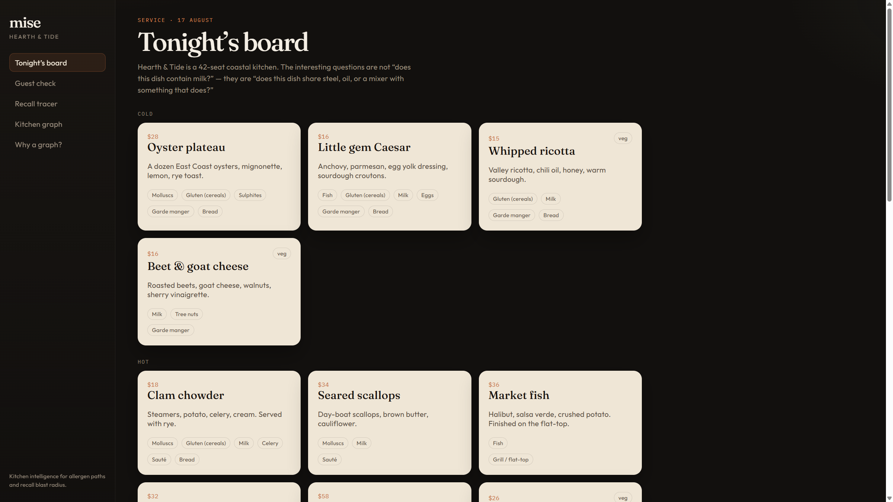
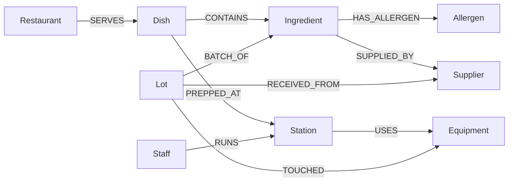
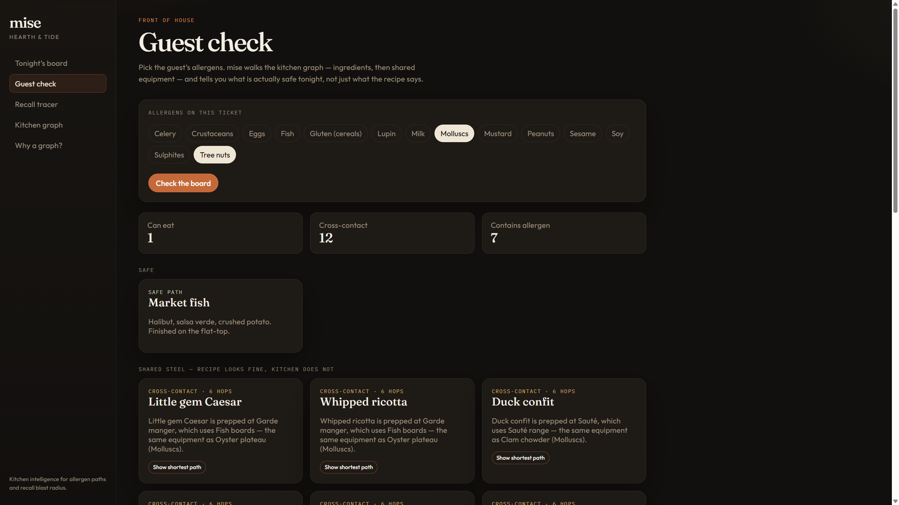
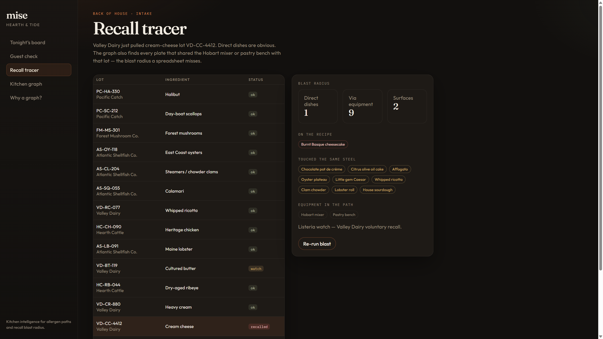
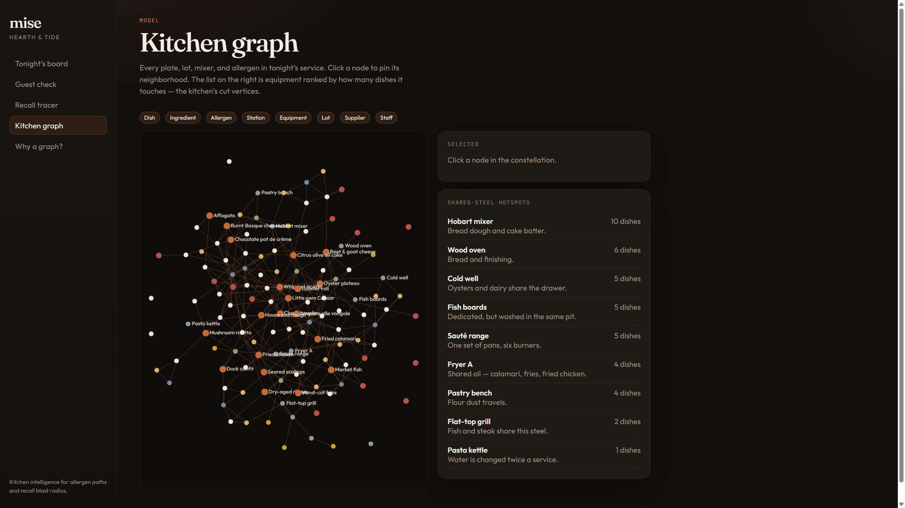

# mise

Kitchen graph intelligence for **Hearth & Tide**, a fictional 42-seat coastal restaurant in Portland, Maine.

mise answers the questions a recipe card cannot: *if this guest cannot eat molluscs, are the fries actually safe?* and *Valley Dairy just recalled a cream-cheese lot — what else in tonight’s service touched the same mixer?*

It is a small, complete web app on **CognoDB** (openCypher over Bolt, official Neo4j JavaScript driver). Connection secrets stay in environment variables.



## Why a graph database?

A menu is a table. A kitchen is a graph.

**What a relational schema already handles:** `Dish → Ingredient → Allergen`. That join is how every allergen app on the App Store works. It is also why people still get sick on “safe” fries. The fries never contained calamari. They shared **Fryer A**.

**What the graph is for:** contamination and recall are *path* problems.

- Unknown hop count (a lot may touch a bench that a station uses that a dish is prepped at).
- Mixed relationship types (`CONTAINS`, `PREPPED_AT`, `USES`, `TOUCHED`, `BATCH_OF`).
- The answer is not only a boolean — the server needs the **path**, so a human can read it out loud: *hand-cut fries → fryer station → Fryer A ← fried calamari → calamari → molluscs*.

In SQL you pre-declare the join depth, `UNION` several shapes, or write a recursive CTE over a polymorphic association table, then reconstruct the story in application code. In Cypher it is a parameterized pattern, and `shortestPath` returns the explanation.

The same model serves two products without a second schema: **guest safety** (allergen paths) and **intake** (recall blast radius). That is the argument for a graph here — not “we have categories with many-to-many links.”

## Data model



| Label | What it is |
| --- | --- |
| `Restaurant` | Hearth & Tide |
| `Dish` | A plate on tonight’s board |
| `Ingredient` | What goes on the plate |
| `Allergen` | The EU-14 list |
| `Station` | Garde manger, grill, fryer, pastry… |
| `Equipment` | The shared steel: Fryer A, Hobart mixer, flat-top |
| `Lot` | A received batch, with `ok` / `watch` / `recalled` |
| `Supplier` | Who sent the lot |
| `Staff` | Who runs the station |

Typed relationships: `SERVES`, `CONTAINS`, `HAS_ALLERGEN`, `PREPPED_AT`, `USES`, `RUNS`, `SUPPLIED_BY`, `BATCH_OF`, `RECEIVED_FROM`, `TOUCHED`.

The seed lives in `scripts/data.ts` and is loaded by `scripts/seed.ts` with parameterized `UNWIND` — no string-concatenated Cypher.

## Setup

### 1. CognoDB Cloud

1. Sign up at [console.cognodb.com/signup](https://console.cognodb.com/signup) (free tier, no credit card).
2. Create a free **c0** instance and pick a region.
3. Copy the Bolt URI (`bolt+s://<id>.databases.cognodb.com` or `.cognodb.cloud`) and the generated password for user `cognodb`. The password is shown once.

### 2. App

```bash
git clone <this-repo>
cd mise   # or the folder you cloned
cp .env.example .env
```

Edit `.env`:

```
NEO4J_URI=bolt+s://YOUR-INSTANCE.databases.cognodb.com
NEO4J_USER=cognodb
NEO4J_PASSWORD=the-password-from-the-console
PORT=3001
```

Never commit `.env`.

```bash
npm install
npm run seed
npm run dev
```

- UI: [http://localhost:5173](http://localhost:5173)
- API: [http://localhost:3001/api/health](http://localhost:3001/api/health)

If the database is down, the UI shows a banner instead of a stack trace. If the graph is empty, it tells you to run `npm run seed`.

### Production

```bash
npm run build
NODE_ENV=production npm start
```

The Express server then serves the built client from `dist/client`. On Render / Railway / Fly, set the same `NEO4J_*` environment variables. A `render.yaml` is included.

Keep the CognoDB instance running until Wexa has reviewed the submission.

## What to click (demo script)

1. **Tonight’s board** — the menu, with declared allergens. Looks like a restaurant. It is not the interesting part.
2. **Guest check** — leave **Tree nuts** and **Molluscs** selected, click **Check the board**.
   - Beet & goat cheese fails *directly* (walnuts).
   - **Hand-cut fries** fail *indirectly*: recipe is potato; path is shared Fryer A with fried calamari.
   - Click **Show shortest path** for the 6-hop explanation.
3. **Recall tracer** — lot `VD-CC-4412` is recalled. Direct dish: Basque cheesecake. Indirect: pastry that shared the Hobart / pastry bench (olive oil cake, sourdough, pot de crème).
4. **Kitchen graph** — click **Fryer A** or **Hobart mixer** in the hotspot list.







## Main queries

All queries are parameterized (`$allergenIds`, `$dishId`, `$lotId`, …). Source: `server/queries.ts`. A copy you can paste into a Cypher console is in `cypher/queries.cypher`.

### 1. Guest check — multi-hop cross-contact

Direct hit: `Dish -[:CONTAINS]-> Ingredient -[:HAS_ALLERGEN]-> Allergen`.

Cross-contact (six hops):

```
Dish -[:PREPPED_AT]-> Station -[:USES]-> Equipment
     <-[:USES]- Station <-[:PREPPED_AT]- other Dish
     -[:CONTAINS]-> Ingredient -[:HAS_ALLERGEN]-> Allergen
```

A dish is only flagged as cross-contact when the allergen is **not** already on its own recipe, which is the case that fools a join table.

### 2. `shortestPath` — the awkward relational query

```cypher
MATCH (d:Dish {id: $dishId}), (a:Allergen {id: $allergenId})
MATCH path = shortestPath((d)-[*1..8]-(a))
RETURN length(path) AS hops, nodes(path), relationships(path)
```

Variable-length, mixed types, and an explanation. That is the query a normalized SQL schema fights.

### 3. Recall blast radius

- Direct: `Lot -[:BATCH_OF]-> Ingredient <-[:CONTAINS]- Dish`
- Indirect: `Lot -[:TOUCHED]-> Equipment <-[:USES]- Station <-[:PREPPED_AT]- Dish`

Same graph, second product.

## Project layout

```
server/           Express API, Neo4j driver, parameterized Cypher
  db.ts           Driver, env config, connectivity errors
  queries.ts      All Cypher
  index.ts        HTTP routes + 503 when CognoDB is down
scripts/          Seed data + loader
client/           Vite + React UI
cypher/           Queries documented for review
```

Stack: TypeScript, Express, official `neo4j-driver`, Vite, React.

## Hosted demo & screen recording

- **Demo:** _add your Render / Railway URL after deploy_
- **Recording:** _add a 60–90s walkthrough (Guest check fries + recall lot VD-CC-4412)_

Deploy: push this repo, create a Render Web Service from `render.yaml`, paste `NEO4J_URI` / `NEO4J_USER` / `NEO4J_PASSWORD` into the service env. Free instances sleep; the first request may wait a minute.

## License

Prepared as a take-home for Wexa AI. Not affiliated with a real restaurant.
